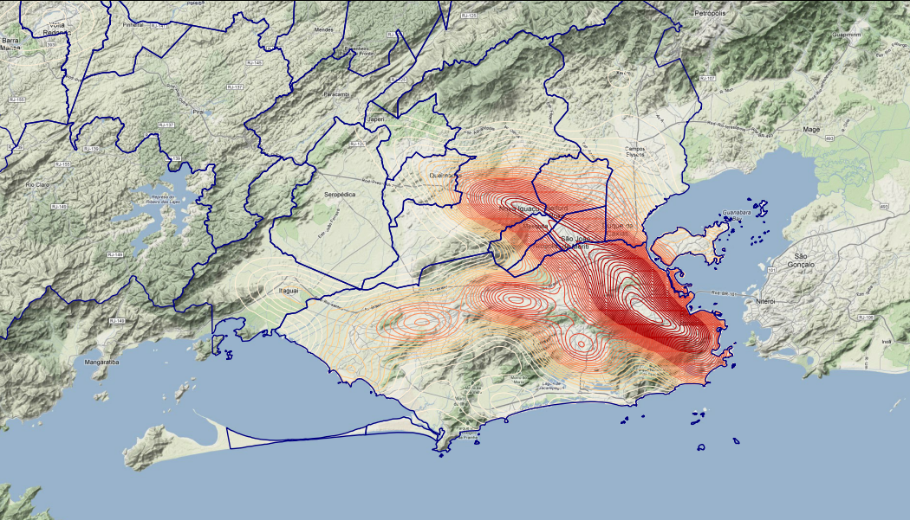
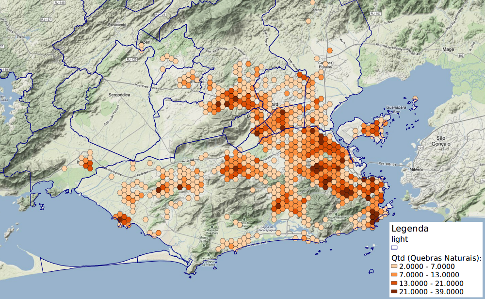

Big Data Analytics
==================

Nesta área desenvolvemos principalmente tecnologias integrando soluções de código aberto para análise eficiente de
grandes volumes de dados estruturados ou não.

Análise e visualização de dados Espacializados
----------------------------------------------
Ao analisar grandes bancos de dados, frequentemente encontramos referências geográficas para certos dados. As vezes estas
referências estão explicitadas no banco, a través de coordenadas espaciais, mas na maioria das vezes encontramos referências
a localidades geográficas, ou endereços que através de nossos algoritmos de análise conseguimos associar às suas coordenadas
geográficas específicas.

Uma vez geo-referenciados os dados, podemos então visualizar e analizar os padrões espaciais.

**Mapa de calor (com linhas de contorno) representando a distribuição espacial de uma variável:**

**Mapa Coroplético com segmentação hexagonal:**

Apoio
-----

.. image:: _static/cnpq.jpg
   :width: 100px

.. image:: _static/fgv.jpg
   :width: 100px

