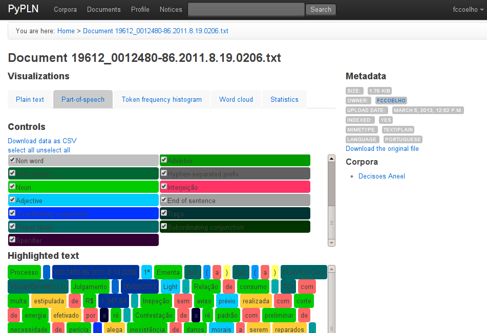

PyPLN
=====

* Website: http://pypln.org
* Web Application: http://fgv.pypln.org

Este projeto consiste em uma plataforma para análise textual de alto nível, envovendo ferramentas de análise léxica,
sintática e semântica de corpora de textos em português e inglês.

 Engloba inovações em vários domínios desde o processamento de linguagem natural, até a infraestrura subjacente de
 processamento distribuído que dá escala ao nossos sistema para analisar eficientemente grandes coleções de texto.

 Este projeto encontra-se em sua primeira versão para uso público, ainda considerada "beta". Mas seu código fonte já
 está disponível online: https://namd.github.com/pypln

Apoio
-----

.. image:: _static/fgv.jpg
   :width: 100px

